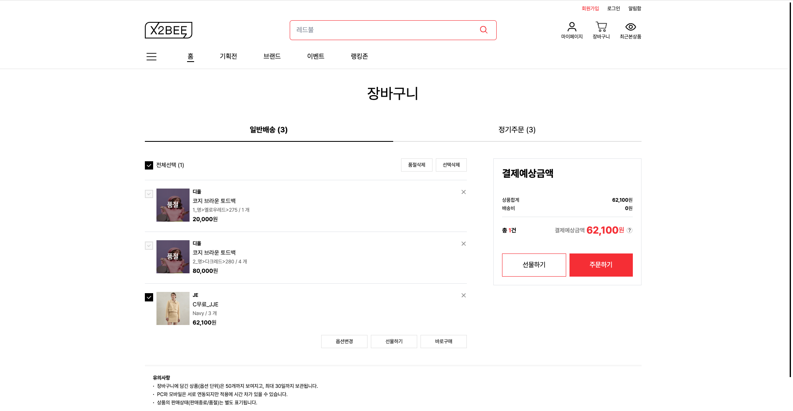
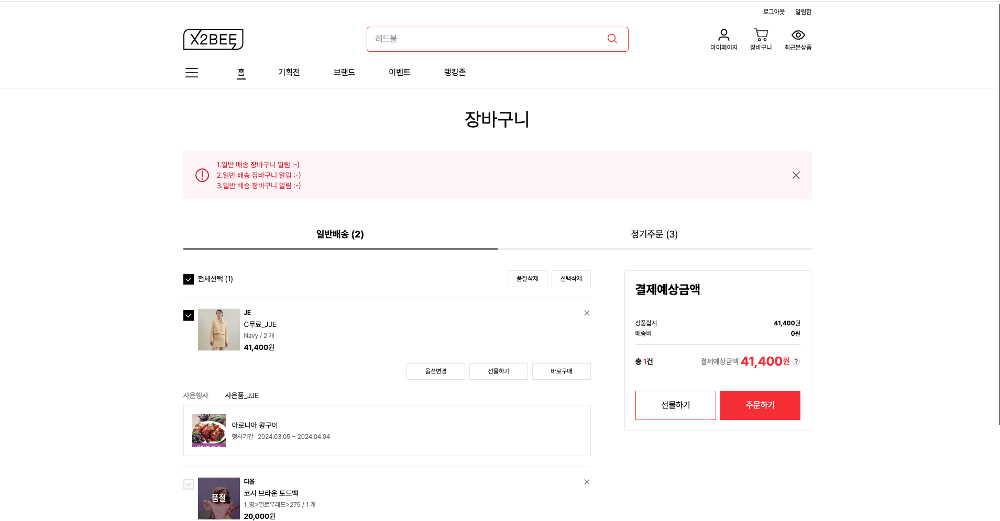
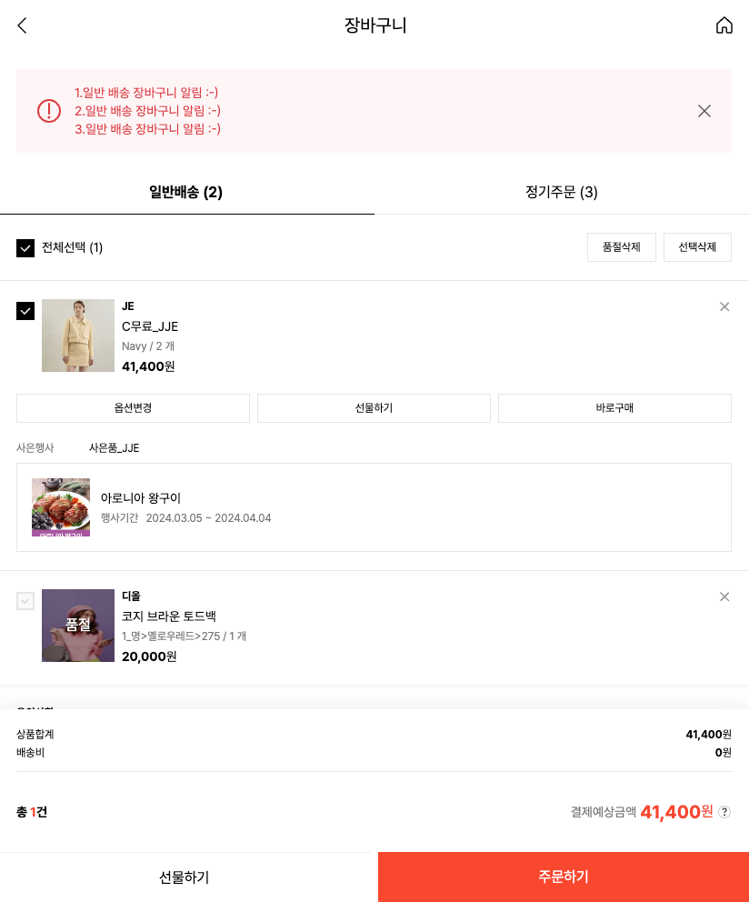
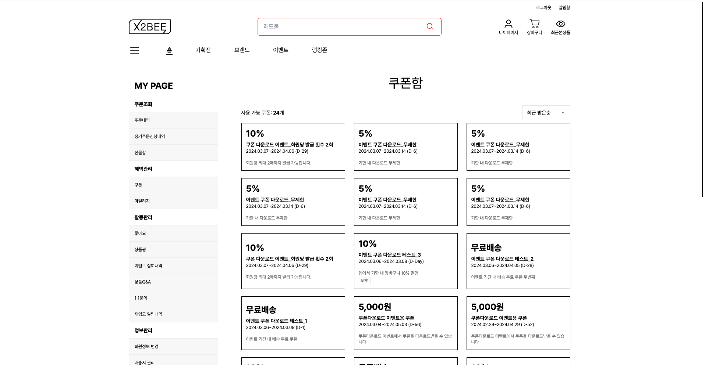
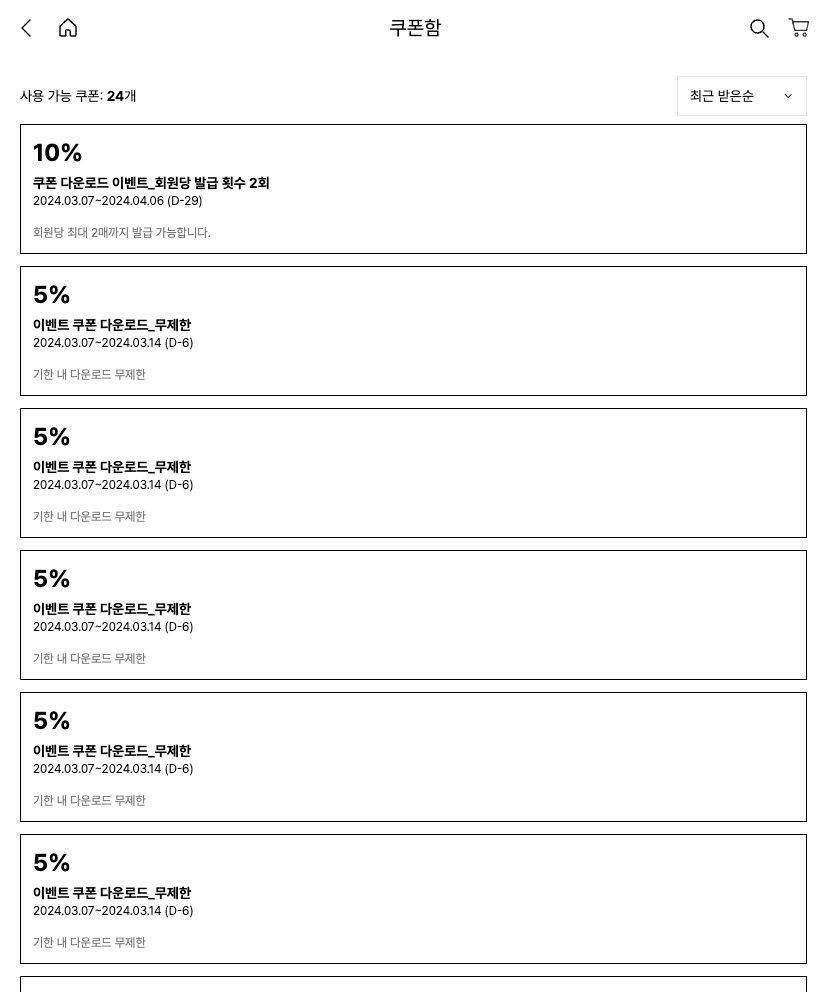
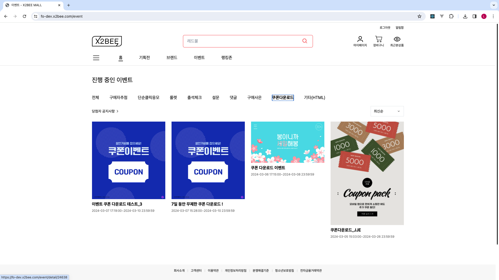
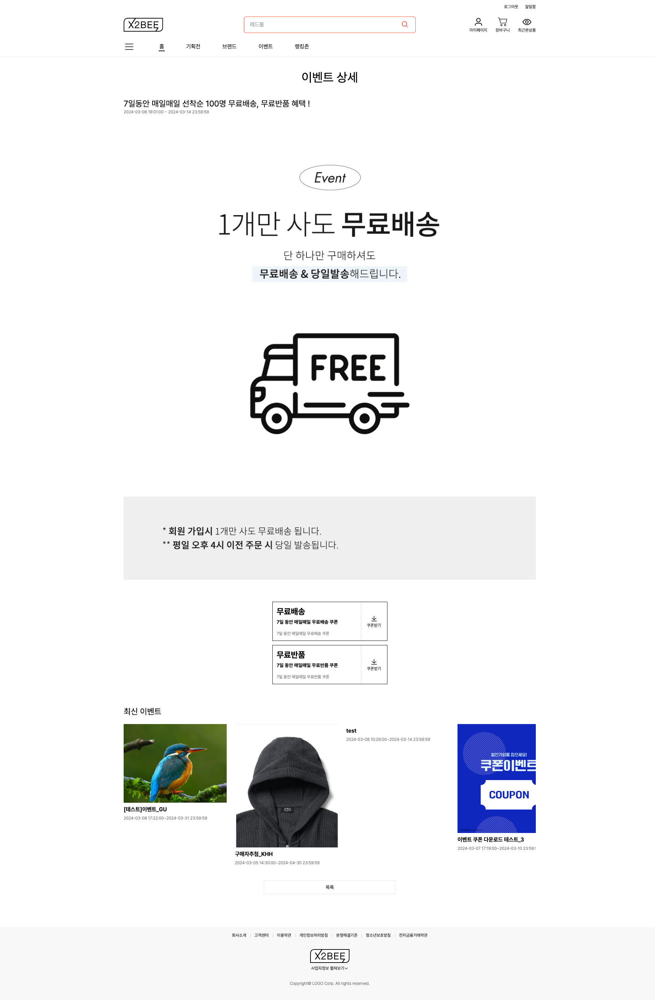
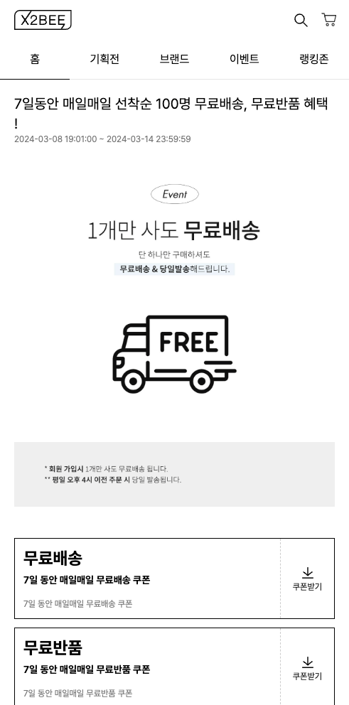

## 포트폴리오

### 프로젝트

#### 플래티어 x2bee 솔루션 | 2024.01 ~ 

| 주문/결제 : 장바구니                                             | 상세 설명                                                                           |
|----------------------------------------------------------|---------------------------------------------------------------------------------|
|  | 비회원 장바구니입니다. 비로그인 상태로 담은 장바구니 목록은 로그인 후에 기존 회원의 장바구니와 병합됩니다.                |
|  | 회원용 장바구니입니다. 상단에 알림이 표시됩니다. 회원 혜택가를 확인할 수 있습니다.  선물하기, 정기주문이 가능합니다. |
|  | 반응형으로 동작합니다. PC 우측의 결제 정보가 하단으로 이동합니다.                                      |

| 회원 : 쿠폰함                                                | 상세 설명                                       |
|---------------------------------------------------------|---------------------------------------------|
|  | 회원의 쿠폰함 목록입니다. 페이징 처리와 정렬 방법 변경이 적용되어 있습니다. |
|  |                                             |

| 이벤트 : 쿠폰 이벤트 상세                                         | 상세 설명                                                                                                          |
|---------------------------------------------------------|----------------------------------------------------------------------------------------------------------------|
|  | 이벤트 페이지 목록입니다.                                                                                                 |
|  | 쿠폰 다운로드 상세 화면입니다.  관리자가 설정한 이벤트 템플릿과 쿠폰 목록이 출력됩니다.  이벤트 참여 설정에 따라 쿠폰 받기 후에 쿠폰받기 / 받기완료 텍스트와 CSS 변경됩니다. |
|   | 모바일 버전입니다.                                                                                                     |