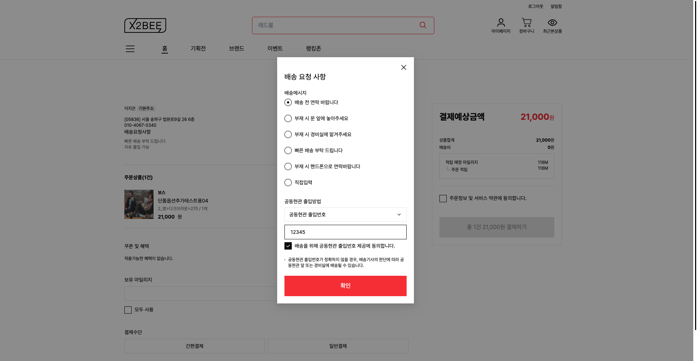
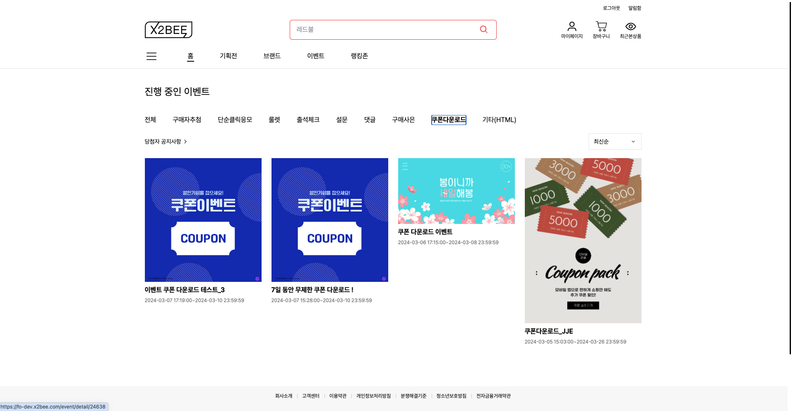
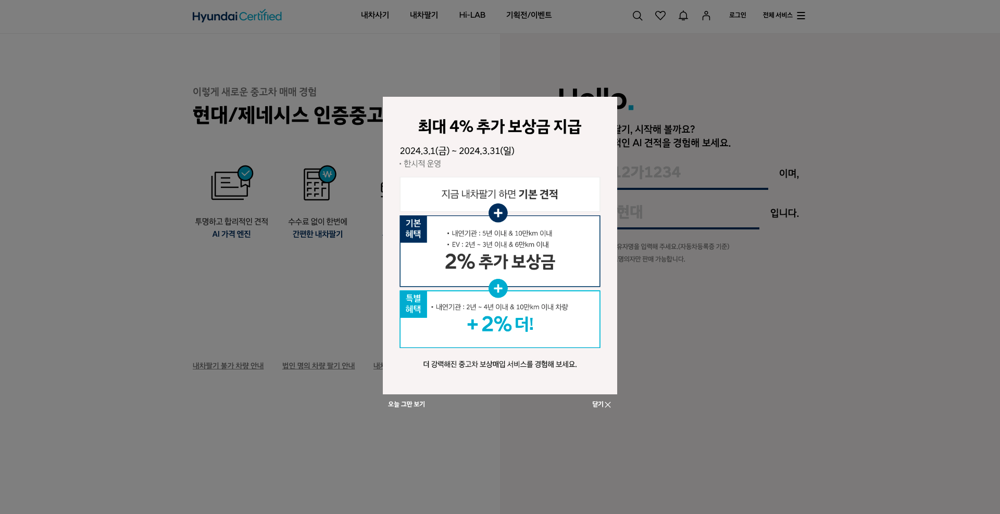
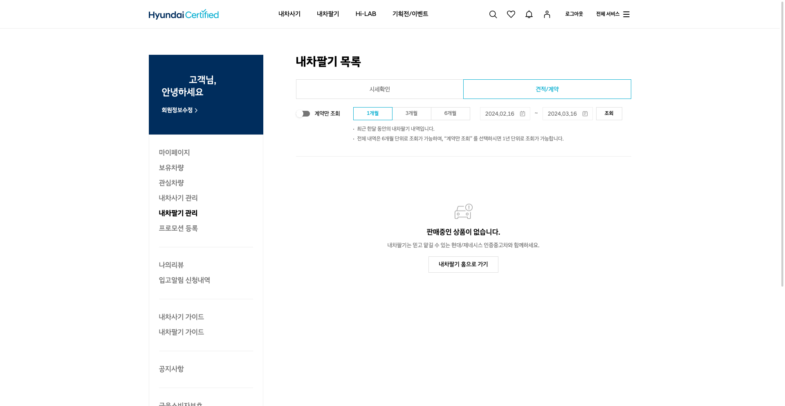

## 프로젝트

### 플래티어 x2bee 솔루션 | 2024.01 ~ 

| 주문/결제 : 장바구니                                             | 상세 설명                                                                              |
|----------------------------------------------------------|------------------------------------------------------------------------------------|
|  | 
비회원 장바구니
비로그인 상태로 담은 장바구니 목록은 로그인 후에 기존 회원의 장바구니와 병합됩니다.                     |
|  | 
회원용 장바구니
상단에 알림이 표시됩니다. 회원 혜택가를 확인할 수 있습니다.  선물하기, 정기주문이 가능합니다. |
|  | 반응형으로 동작합니다. PC 우측의 결제 정보가 하단으로 이동합니다.                                         |

| 주문/결제 : 배송요청사항 모달                                                   | 상세 설명                                                                         |
|---------------------------------------------------------------------|-------------------------------------------------------------------------------|
|  | 
주문 시에 배송 요청사항을 선택하는 모달
radio button, select box change 이벤트를 통해 변화하는 값을 상위 컴포넌트에 전달합니다. |

| 회원 : 쿠폰함                                                                                                                                                                | 상세 설명                                                                            |
|-------------------------------------------------------------------------------------------------------------------------------------------------------------------------|----------------------------------------------------------------------------------|
| 

 | 
회원의 쿠폰함 목록
 페이징 처리와 정렬 방법 변경이 적용되어 있습니다. MO, PC에 따라 페이지 당 데이터 수가 다릅니다. |

| 이벤트 : 쿠폰 이벤트 상세                                                                                                                         | 상세 설명                                                                                                          |
|-----------------------------------------------------------------------------------------------------------------------------------------|----------------------------------------------------------------------------------------------------------------|
|                                                                                  | 
이벤트 목록
                                                                                              |
|  | 
쿠폰 다운로드 이벤트 상세 화면 (좌: PC, 우: MO)
 관리자가 설정한 이벤트 템플릿과 쿠폰 목록이 노출됩니다.  이벤트 참여 설정에 따라 쿠폰 받기 후에 쿠폰받기 / 받기완료 텍스트와 CSS 변경됩니다. |

### 현대 인증중고차 프로젝트 | 2022.04 ~ 2023.12

| 내차팔기 : 메인 ~ 방문평가 신청                                     | 설명                                                                                 |
|---------------------------------------------------------|------------------------------------------------------------------------------------|
|     | 
내차팔기
고객이 자신의 중고차 시세를 조회하고, 진단받고, 차량을 판매할 수 있습니다.  차량번호, 소유주명으로 차량을 조회합니다. |
|  | 
내차팔기 관리
 내차팔기 방문평가 신청 이후로 마이페이지 내차팔기 관리 화면에서 확인할 수 있습니다. 차량을 선택 시 상세 페이지로 이동됩니다.   PC, MO 화면이 각각의 html, css로 관리됩니다.|

